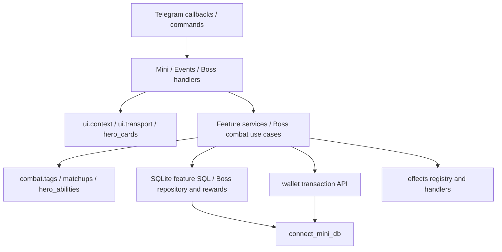

# Архитектура V1.3

## Точки входа и зависимости

`bot.py` выполняет обычную схему, Mini migration steps, Boss migrator,
world/catalog sync; затем подключает 10 parent routers и запускает polling.
Mini и Boss включают feature subrouters. `check_bot.py` выполняет startup
проверки без polling. Обычные timers восстанавливаются через
`app/services/timers.py`; Boss watcher восстанавливает public turn и таймауты.
`deploy/` содержит systemd unit/path и прежний compile-before-restart script.
Path unit дополнен всеми вложенными module/catalog directories; тест проверяет
их покрытие. Установка обновлённого unit выполняется при deploy на Linux.

`combat/` не импортирует Boss, aiogram или DB/config. Hero hooks принимают
данные, возвращают результаты и event plans. Исторические имена параметров
`boss_hp_before`, `boss_max_hp` сохраняют сигнатуры; другой игровой режим может
передавать туда параметры своего противника. Boss-specific hooks и reward
shields остаются в Boss.

`mini/__init__.py` и `boss/__init__.py` не загружают сервисы. Импортируй сервис
из модуля-владельца, например `app.mini.wallet` или `app.mini.boss.combat`.

## Telegram UI

- `ui/context.py`: callback build/parse, owner/world/player checks, player touch.
  Shop context сохраняет прежнюю семантику без touch. Events дополнительно
  проверяет chat/topic; публичные Boss callbacks используют identity нажатия.
- `ui/transport.py`: callback parameters, send-new-then-delete-old, launcher
  send и fallback редактирования старого публичного меню. Ошибка/неопределённый
  результат отправки не приводит к повторной отправке или удалению старого меню.
- `ui/hero_cards.py`: общий caption и media helpers для home, гачи и inventory.
  Командная отправка home и публичные Boss сообщения сохраняют особую семантику.
- Screen modules импортируют shared helpers и сервисы, не другие handlers.

Mini `handlers.py` оставлен home/launcher/character module и parent router.
Boss `handlers.py` оставлен combat callbacks module и parent router.
Registration/admin и hero selection имеют отдельные subrouters. Существующие callback formats сохранены; Tower и Equipment используют отдельные prefixes.

## Coins и транзакции

`wallet.py` — единственное место UPDATE coins и INSERT wallet history.

`change_balance()` открывает `BEGIN IMMEDIATE`. Публичный
`change_balance_in_transaction(conn, ...)` требует уже открытую транзакцию,
не выполняет commit/rollback и возвращает `applied`, `transaction_id`, `balance`.
Operation key проверяется до изменения баланса; уникальный индекс сохраняется.
Reasons, reference fields и key formats прежние. `allow_zero=True` используется
только для совместимости с конфигурируемой нулевой ценой продажи shards;
обычный wallet API продолжает отклонять нулевые изменения.

Daily claim, purchase/delivery, gacha pull/hero/ticket, item use/result, event
session/request и Boss reward flags входят в транзакцию своего use case.
`connect_mini_db` коммитит при успехе, откатывает при исключении и закрывает
connection. Shards сохраняют существующую модель без coin ledger.

## Boss combat

- `calculations.py`: primary attack, hero passive, faction modifier, Boss damage
  modifier, potion bonus; порядок integer arithmetic сохранён.
- `combat.py`: start/hit/timeout/admin-finish use cases, validation и transaction
  ownership. Public signatures и return dictionaries сохранены.
- `runtime.py`: turn progression, forced skips, echo/extra attack, reward guard,
  Boss turn и смерть; существующий порядок hooks сохранён.
- `repository.py`: loadout writes, runtime effects, primary attacks, timeout
  journal, queued skips и structured events. Не открывает свои транзакции.
- `rewards.py`: eligible participants, victory/admin/failure payouts, reward
  flags и завершение боя в транзакции вызывающего use case.
- `loadouts.py`, `schema.py`, `public.py`, `watcher.py`: существующее восстановление
  снимков, legacy events, публичного хода и deduplication.

Некоторые scoped SQL operations остаются в runtime и feature services. ORM,
repository interface на каждый SELECT и новый универсальный combat engine
не вводились. Pure engines остаются отдельными.

## Схема и миграции

`init_mini_db()` открывает одну `BEGIN IMMEDIATE` транзакцию с foreign keys.
`migrations/` выполняет `core`, `inventory`, `activities`, затем `legacy`.
CREATE IF NOT EXISTS и проверки PRAGMA table_info делают steps повторяемыми.
Legacy conversions сохраняют guard conditions: shards переносятся только при
отсутствии player.shards; старый per-hero столбец остаётся. Wallet operation
index создаётся после добавления operation_key. DDL и данные откатываются вместе.

Для новой Mini feature добавь небольшой `apply(conn)` module в конец
`MIGRATIONS`. Не добавляй commit, executescript или destructive table rebuild
в step. Изменение legacy conversion требует отдельной regression fixture.
Существующий отдельный Boss migrator сохраняется; он выполняет freeze legacy
loadouts до catalog sync и переносит old ability events по legacy_action_id.

Проверки покрывают 23 Mini tables и 4 Boss tables: worlds, players, heroes/ownership/stars,
wallet, items/inventory/effects/uses, daily, offers/purchases, gacha, event
sessions/requests, bosses/participants/actions/events. Проверяются old columns,
перенос shards, running battle snapshots, repeated init и rollback DDL.

## Effect/content contracts

`effects/contracts.py` определяет `EffectDefinition` и `ItemEffectContext`.
`effects/registry.py` регистрирует шесть существующих keys и связывает key,
описание, active title и callable handler. `effects/builtins.py` содержит
coin pouch, shard casket и charged effect handlers. Gacha ticket остаётся
зарегистрированным ключом без inventory-use handler: расход выполняет gacha.

Добавление effect: создай handler, принимающий context, и зарегистрируй
`EffectDefinition`. Handler работает в предоставленной транзакции, меняет
result и использует supplied wallet/charge functions. Inventory decrement,
operation replay и запись item-use result принадлежат `items.py` и не копируются
в handler. Нельзя самостоятельно открывать/коммитить транзакцию.

Hero/shop/Boss item/Boss ability catalogs проверяются при загрузке JSON.
Item keys валидируются registry; fixed faction/damage/range sets находятся
в `combat/tags.py`. Class/special/feature strings открытые и проверяются через
`is_open_tag`. `MAGIC_CLASSES` и `TECHNICAL_CLASS` используются и движком, и
content safety. Production labels остаются в `presentation.py`; check_bot
проверяет отображение и наличие active counters.

## Совместимость и дальнейшая работа

Сохранены прямые imports старого `boss.matchups` и `boss.abilities`;
последний alias указывает на тот же engine module, поэтому старые patch points
не теряют связь с runtime. Сохранены используемые tests formatter/keyboard
aliases в handlers и `_finish_victory`. Неиспользуемые package-wide eager
exports и wrappers удалены. Assertions старых тестов не ослаблялись.

Tower владеет своими content, состояниями, handlers, service, combat adapter,
repository и reward policy в `app/mini/tower/`. Equipment имеет отдельные ownership,
слоты, flat aggregate и service в `app/mini/equipment/`, не использует ItemEffectContext.
`app/mini/superadmin/` содержит ID authorization, parser, transactional service и handlers.
`app/topic_guard.py` разделяет ordinary D&D и Mini по target/current topic.
`create.py` подключён к ROUTERS; legacy inventory handlers удалены.
Полный контракт релиза, миграция и баланс: [V1.3](V1.3.md).

Оставшийся долг: dict/SQLite Row contracts в зрелых сервисах, локальный SQL
runtime, синхронный SQLite в handlers и исторические patch aliases.
Эти системы сохраняют прежнее поведение.
